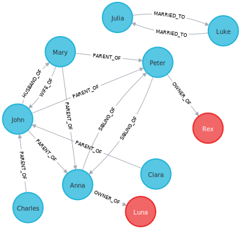

# Family Graph
I'll use a neo4j sandbox.

## Mermaid Graph


## Neo4j Graph


## Run the Project
1. Clone the repository
```bash
git clone
```
2. Run the cypher script, in `cypher/family_graph.cypher` in the neo4j browser to create the graph.
3. Install the requirements
```bash
pip install -r requirements.txt
```
4. Create a `.env` file running the following script:
  - UNIX/Mac
  ```bash
  ./create_env.sh
  ```
  - Windows
  ```bash
  ./create_env.bat
  ```
5. Edit the `.env` file with your neo4j sandbox credentials, provided when you create an account or new project.
6. Run the project
```bash
python main.py
```
